# Skill Assessment Agent

> Conversational skill assessment + personalised learning plan agent. A LangGraph supervisor over five workers — Parser, Interviewer (IRT-driven adaptive questioning), Scorer (Bloom-tagged rubric), GapAnalyzer (ESCO-grounded), and PlanGenerator — backed by Mem0 for cross-session candidate memory.

Built for the Deccan AI hackathon. Submission deadline: **Mon Apr 27, 2026, 1:00 AM IST**.

---

## What it does

A resume tells you what someone *claims* to know. This agent finds out what they *actually* know.

1. **Ingests** a job description and a candidate's resume.
2. **Conversationally probes** each required skill with adaptive questioning that gets harder when the candidate is doing well and easier when they're struggling — implementing a lightweight IRT (Item Response Theory) loop.
3. **Scores** each skill 1-5 on a Bloom-aligned rubric (Remember → Understand → Apply → Analyze → Evaluate/Create), with mandatory evidence quotes and a confidence rating.
4. **Identifies gaps** by matching scored proficiency against JD requirements via ESCO skill ontology.
5. **Generates a learning plan** of *adjacent* skills the candidate can realistically acquire, with curated resources from roadmap.sh, freeCodeCamp, YouTube, and DEV.to, and time-to-acquire estimates.

---

## Architecture

```mermaid
flowchart LR
    Start([POST /assess/start<br/>resume + JD]) --> Sup{Supervisor<br/>state-machine router}

    Sup -->|no resume.parsed| Parser
    Sup -->|interview pending| Interviewer
    Sup -->|turns scored?| Scorer
    Sup -->|gaps mapped?| Gap[GapAnalyzer]
    Sup -->|plan built?| Plan[PlanGenerator]
    Sup -->|all done| End([END])

    Parser -->|Resume + JD<br/>typed via Instructor| Sup
    Interviewer -.->|interrupt&#40;&#41; for HITL<br/>per question| HITL[(POST /respond<br/>candidate's answer)]
    HITL -.->|Command&#40;resume=...&#41;| Interviewer
    Interviewer -->|InterviewTurn appended<br/>+ IRT theta updated| Sup
    Scorer -->|SkillAssessment&#91;&#93;<br/>w/ evidence + confidence| Sup
    Gap -->|GapAnalysis<br/>severity-ranked + adjacency| Sup
    Plan -->|LearningPlan<br/>MALPP-validated modules| Sup

    SQLite[(SQLite checkpointer<br/>thread_id = session_id)] -.-> Sup

    style Sup fill:#4f46e5,color:#fff,stroke:#6366f1
    style Interviewer fill:#1a1a25,color:#e5e7eb,stroke:#6366f1,stroke-width:2px
    style Scorer fill:#1a1a25,color:#e5e7eb,stroke:#6366f1
    style Gap fill:#1a1a25,color:#e5e7eb,stroke:#6366f1
    style Plan fill:#1a1a25,color:#e5e7eb,stroke:#6366f1
    style Parser fill:#1a1a25,color:#e5e7eb,stroke:#6366f1
    style HITL fill:#10b981,color:#fff
    style SQLite fill:#262635,color:#94a3b8
```



State and routing flow through a single `AssessmentState` TypedDict ([`backend/app/graph/state.py`](backend/app/graph/state.py)). Every worker is an async function `(state) -> partial_state_update`. The Supervisor is **deterministic** (state-machine, not LLM-routed) — chosen for predictability under demo conditions.

**HITL pause/resume.** The Interviewer uses LangGraph `interrupt()` to pause the graph after generating each question. The candidate's answer arrives via `POST /api/assess/respond` and resumes the graph with `Command(resume=...)`. SQLite checkpointer means a session can survive an app restart.

**Memory.** LangGraph SQLite `MemorySaver` checkpointer keys on `thread_id = session_id` for in-session conversation. Mem0 (optional) keys on `user_id` for cross-session candidate facts.

**Observability.** Toggle `LANGSMITH_TRACING=true` in `.env` and the entire graph trace shows up in LangSmith — node-by-node, with timing and structured outputs.

---

## Scoring & logic

This section documents the per-stage decision rules so reviewers (and future Abhay) can audit them without reading the source.

### Stage 1 — Parsing (`parser_node`)

- LLM (Instructor + Pydantic) extracts `Resume` and `JobDescription` from raw text.
- `temperature=0.0` for determinism.
- `skills_to_assess` is the JD's required + preferred skills, ordered as:
  1. Required skills the candidate **also claims** on the resume — highest signal, verify first.
  2. Required skills the candidate did **not** claim — gap exploration.
  3. Preferred skills — only if time/turns allow.

### Stage 2 — Adaptive interviewing (`interviewer_node` + `irt.py`)

The Interviewer drives an **IRT (Rasch / 1PL) adaptive question loop** per skill.

- **Difficulty parameter `b`** is set from Bloom level (1=Remember, 2=Understand, 3=Apply, 4=Analyze, 5=Evaluate), centered so `b = level − 3`.
- **Ability `θ` per skill** starts at 0 (no prior). After each scored response, θ is updated via Newton-Raphson MAP estimation (5 iterations, Gaussian prior with weight 0.5 to prevent wild swings on n=1).
- **Next question's Bloom level** is whichever `b` is closest to current θ (max-information point under Rasch), preferring not-yet-asked levels.
- **Per-skill termination** — stop probing when:
  - Hard cap: `n_questions >= MAX_QUESTIONS_PER_SKILL` (default 4), OR
  - Soft stop: `n_questions >= MIN_QUESTIONS_PER_SKILL` (default 2) AND `confidence ≥ IRT_CONFIDENCE_THRESHOLD` (default 0.7) where confidence = `1 / (1 + standard_error)`.
- **Response scoring** is continuous in [0, 1] (not binary) so partial credit feeds into θ. Returned by an LLM call against an explicit rubric with prompt-injection defense (candidate text wrapped in `<candidate_response>` delimiters).

### Stage 3 — Per-skill scoring (`scorer_node`)

Each skill gets exactly one `SkillAssessment` synthesized from three inputs:

- **Quantitative**: converged θ from IRT (snapped to nearest Bloom level via `theta_to_bloom`).
- **Qualitative**: an LLM call with a 3-point evidence-quality rubric (`HIGH` / `MEDIUM` / `LOW`) — chosen over 1-10 because Databricks' research shows low-precision rubrics are dramatically more consistent.
- **Evidence**: mandatory direct quotes from both the resume excerpt and the interview turns. Pydantic enforces `min_length=1`.

`confidence` is a function of evidence_quality plus a small bonus for more interview turns:
```python
base = {"HIGH": 0.9, "MEDIUM": 0.65, "LOW": 0.4}
bonus = min(0.05 * max(0, n_turns - 1), 0.1)
confidence = min(1.0, base + bonus)
```

`gap_to_required = required_level − assessed_level` where `required_level` is derived from JD seniority:
- senior/staff/principal/lead → ANALYZE (4)
- mid/junior → APPLY (3)
- preferred-only skills → UNDERSTAND (2)

### Stage 4 — Gap analysis (`gap_analyzer_node`)

For each JD skill:
- If `assessed_level >= required_level` → strength.
- Otherwise → gap, with `severity` computed as:
  ```python
  base = 0.85 if required else 0.30
  gap_factor = min(1.0, (required_level - current_level) / 4.0)
  confidence_weight = 0.5 + 0.5 * assessment.confidence
  severity = min(1.0, base * gap_factor * confidence_weight)
  ```

For each gap, **adjacent already-known skills** are computed via `sentence-transformers/all-mpnet-base-v2` cosine similarity over the candidate's resume skills (top 3 with `min_similarity=0.35`). These adjacencies are what the PlanGenerator leverages as "transferable foundations". The whole adjacency path degrades gracefully to `[]` if the model can't be loaded (network, OOM, missing dep).

`overall_match_score = (required-skill strengths / total required skills) × (0.5 + 0.5 × avg confidence)` — the confidence multiplier prevents a 100% match score from a low-quality interview.

The candidate-facing summary is one paragraph written by an LLM call with explicit "honest, encouraging, no corporate fluff" tone.

### Stage 5 — Personalised learning plan (`plan_generator_node`)

Implements the **MALPP three-agent pattern** (arXiv:2601.17346):

1. **Diagnose** — given `GapAnalysis` + the candidate's known skills, an LLM call decides which gaps to include (skip severity < 0.2), in what prerequisite-respecting order, with what target Bloom level.
2. **Reflect** — a separate LLM call validates the plan against five checks: critical-gap coverage, prerequisite existence, ordering, hallucinated leveraged skills, target-level adequacy.
3. **Retry** — if `is_valid=false`, re-run Diagnose with reflection feedback. Hard cap of 2 reflection rounds (avoids infinite loops, tokens stay bounded).

After MALPP produces the modules, the planner attaches **real curated resources** from four sources, in priority order:
- **roadmap.sh** — always-available deep link, no network call (guaranteed fallback).
- **freeCodeCamp catalog** — hardcoded mapping for ~12 common skills with explicit hour estimates.
- **YouTube Data API v3** — videos filtered to `videoDuration=medium` (4-20 min).
- **DEV.to API** — articles with their published `reading_time_minutes`.

All async fetchers gracefully return `[]` on any failure (no API key, network down, parsing errors). Each module is capped at 4 resources.

**Time estimation per module:**
```python
base_hours = sum(resource.estimated_minutes for r in resources) / 60
multiplier = 2.0 if current_level is None      # beginner
           = 1.5 if level_gap >= 2             # intermediate
           = 1.0 otherwise                     # advanced (just polishing)
hours_min = max(4.0, base_hours * multiplier)
hours_max = hours_min * 1.5                    # accounts for practice/projects
```

---

## Tech stack

**Backend** Python 3.11+ · FastAPI · LangGraph 0.2 · langgraph-supervisor · Instructor · Pydantic v2 · Mem0 · sentence-transformers · Chroma · DeepEval

**Frontend** Next.js 15 · React 19 · TypeScript · Tailwind v3 · ReactFlow · lucide-react

**Models** `gpt-4o-mini` for Parser/Scorer/Supervisor/GapAnalyzer (cheap, structured) · `gpt-4o` for Interviewer/PlanGenerator (reasoning + creativity). Anthropic Claude Haiku 4.5 / Sonnet are drop-in alternatives via env config.

---

## Differentiators

Three things this submission does that most won't:

1. **IRT-driven adaptive questioning, visible in the UI.** Question difficulty tracks the candidate's running ability estimate (θ) via a 1-parameter Rasch model. The right-hand sidebar shows θ updating live as questions are answered — judges can *watch* the system step difficulty up after a strong answer and step it down after a weak one. Grounded in Stanford CRFM's 2025 adaptive-testing work showing Spearman ρ > 0.96 with only 8.5% of full-test items.
2. **Embedding-based adjacency for "transferable foundations".** Gaps aren't presented as a flat list — the UI's ReactFlow skill graph shows which already-known skills make each gap *learnable* via cosine similarity over `sentence-transformers/all-mpnet-base-v2`. The PlanGenerator uses the same adjacencies as the rationale for module ordering.
3. **Evidence-required scoring with mandatory confidence.** Every per-skill rating ships with direct quotes from the resume and the interview, plus a 0-1 confidence number. Pydantic enforces `min_length=1` on the evidence list at the schema level — there is no code path that produces a black-box rating.

---

## Build status

| Stage | Status | What's in it |
|------:|--------|--------------|
| 1 | ✅ Done | Repo scaffold · Pydantic schemas · `AssessmentState` · FastAPI skeleton · config · health route · stub assessment routes |
| 2 | ✅ Done | Supervisor + 5 workers + SQLite checkpointer + smoke test |
| 3 | ✅ Done | **IRT-driven Interviewer** with `interrupt()` HITL · Bloom-tagged question generation · response scoring with prompt-injection defense |
| 4 | ✅ Done | **Real Scorer** (3-point evidence-quality rubric, IRT-fused, mandatory evidence + confidence) · **Real GapAnalyzer** (severity-weighted, sentence-transformers adjacency, LLM summary) |
| 5 | ✅ Done | **Real PlanGenerator** (MALPP three-agent pattern: Diagnose → Reflect → retry) · resource fetchers (roadmap.sh, freeCodeCamp catalog, YouTube Data API, DEV.to) · difficulty-multiplier time estimates |
| 6 | ✅ Done | **Next.js 15 frontend**: landing page · IRT-driven interview UI with live theta sidebar · ReactFlow skill graph · per-skill assessments with evidence quotes · learning plan with curated resources |
| 7 | ✅ Done | Mermaid architecture diagram · formal Scoring & logic doc · 3 sample input/output cases · demo video script · submission checklist · CVE-patched Next bump |
| 8 | 🟡 Code-complete | Voice mode via Pipecat — Deepgram STT + ElevenLabs TTS + Daily/Twilio transport. Not exercised in CI; needs live credentials to demo. See [`voice/README.md`](voice/README.md). |

---

## Local setup

### Prerequisites

- Python 3.11+
- Node.js 20+ (Node 22 tested)
- An OpenAI or Anthropic API key
- (Optional) LangSmith API key for tracing
- (Optional) YouTube Data API key for video resources in the learning plan

### Backend

```bash
cd backend
python -m venv .venv
source .venv/bin/activate           # Windows: .venv\Scripts\activate
pip install -r requirements.txt
cp .env.example .env                 # then edit .env with your OPENAI_API_KEY
uvicorn app.main:app --reload --port 8000
```

Health check: <http://localhost:8000/api/health>
Readiness (env validation): <http://localhost:8000/api/ready>
Auto docs: <http://localhost:8000/docs>

### Frontend

```bash
cd frontend
npm install
cp .env.example .env.local           # default points at http://localhost:8000
npm run dev
```

Then open <http://localhost:3000>. The landing page has a "Load sample resume + JD" button that pre-fills realistic content for the demo.

### Smoke tests (no API key required)

The backend ships with five end-to-end smoke tests that exercise the full graph using mocked LLM calls. Useful for a sanity check after making changes:

```bash
cd backend
python tests/smoke_stage2.py    # supervisor + 5 workers + checkpointer
python tests/smoke_stage3.py    # IRT loop + interrupt/resume cycle
python tests/smoke_stage4.py    # real Scorer + GapAnalyzer
python tests/smoke_stage5.py    # PlanGenerator with MALPP reflection loop
```

Each test prints a `✅ STAGE N SMOKE TEST PASSED` line on success.

---

## Project layout

```
skill-assessment-agent/
├── backend/
│   ├── app/
│   │   ├── api/                       # FastAPI routes
│   │   │   ├── health.py
│   │   │   └── assessment.py          # /start, /respond, /result
│   │   ├── graph/                     # LangGraph supervisor + workers
│   │   │   ├── nodes/
│   │   │   │   ├── parser.py          # Resume + JD → typed schemas
│   │   │   │   ├── supervisor.py      # deterministic state-machine router
│   │   │   │   ├── interviewer.py     # IRT loop + interrupt() for HITL
│   │   │   │   ├── scorer.py          # IRT-fused rubric scoring with evidence
│   │   │   │   ├── gap_analyzer.py    # severity-weighted gaps + adjacency
│   │   │   │   └── plan_generator.py  # MALPP: Diagnose → Reflect → retry
│   │   │   ├── irt.py                 # pure IRT/Rasch math
│   │   │   ├── question_gen.py        # Bloom-targeted Q gen + scoring
│   │   │   ├── skill_embeddings.py    # sentence-transformers adjacency
│   │   │   ├── resource_fetchers.py   # roadmap.sh, YT, fCC, DEV.to
│   │   │   ├── state.py               # AssessmentState TypedDict + IRTState
│   │   │   └── builder.py             # graph compilation + SQLite checkpointer
│   │   ├── models/
│   │   │   └── schemas.py             # Pydantic contracts between nodes
│   │   ├── llm.py                     # Instructor-wrapped client factory
│   │   ├── config.py                  # Pydantic Settings
│   │   └── main.py                    # FastAPI entrypoint
│   ├── tests/                         # smoke tests with mocked LLMs
│   │   ├── smoke_stage2.py
│   │   ├── smoke_stage3.py
│   │   ├── smoke_stage4.py
│   │   └── smoke_stage5.py
│   ├── requirements.txt
│   └── .env.example
├── frontend/
│   ├── app/
│   │   ├── page.tsx                   # landing: paste resume + JD
│   │   ├── assess/[sessionId]/        # IRT-driven interview UI
│   │   ├── result/[sessionId]/        # final dashboard with skill graph
│   │   ├── layout.tsx
│   │   └── globals.css
│   ├── components/
│   │   ├── IrtSidebar.tsx             # live theta tracker (differentiator viz)
│   │   └── SkillGraph.tsx             # ReactFlow strengths→gaps graph
│   ├── lib/
│   │   ├── types.ts                   # TS mirror of Pydantic models
│   │   ├── api.ts                     # typed fetch wrapper
│   │   ├── cn.ts                      # Tailwind utility + Bloom/severity colors
│   │   └── sample-data.ts             # demo resume + JD
│   ├── package.json                   # Next 15 + React 19 + ReactFlow
│   └── .env.example
├── voice/                             # Stage 8 — voice mode (optional)
│   ├── gateway.py                     # Pipecat pipeline wrapping the same /start /respond
│   ├── requirements.txt               # voice-only deps
│   └── README.md                      # setup + run instructions
├── samples/                           # 3 end-to-end JD/resume cases
│   ├── 01_senior_ai_engineer.json     # mixed gaps — headline demo case
│   ├── 02_frontend_to_ml_pivot.json   # heavy gaps — long plan
│   ├── 03_strong_fit_minimal_gap.json # no gaps — congratulatory empty plan
│   └── README.md
├── DEMO_SCRIPT.md                     # 4-minute demo video script
├── SUBMISSION.md                      # hackathon submission checklist
├── .gitignore
└── README.md
```

---

## Submission artifacts

- **[SUBMISSION.md](SUBMISSION.md)** — checklist mapped to the hackathon's submission form fields
- **[DEMO_SCRIPT.md](DEMO_SCRIPT.md)** — 4-minute demo video script (beat-by-beat)
- **[samples/](samples/)** — three sample inputs covering mixed/heavy-gap/no-gap branches
- **[voice/](voice/)** — optional Stage 8 voice mode (Pipecat-based, not required for submission)

Pre-submission, run all four backend smoke tests:

```bash
cd backend
python tests/smoke_stage2.py && python tests/smoke_stage3.py && \
  python tests/smoke_stage4.py && python tests/smoke_stage5.py
```

All four should print `✅ STAGE N SMOKE TEST PASSED`.

---

## Research foundations

The architecture is grounded in published 2025–2026 work:

- **Anthropic, "Building Effective Agents"** (Dec 2024) — Orchestrator-Workers pattern.
- **Lo et al., "AI Hiring with LLMs"** (CVPR 2025 workshop, arXiv:2504.02870) — multi-agent resume-screening framework validated against HR-pro ratings.
- **"Steve: LLM Powered ChatBot for Career Progression"** (arXiv:2504.03789, Apr 2025) — closest published peer to this problem.
- **"LLM-as-an-Interviewer"** (Kim et al., arXiv:2412.10424) — three-stage interview flow with question modification + clarifying probes.
- **"GenMentor"** (WWW 2025) and **MALPP** (arXiv:2601.17346) — multi-agent learning-path generation patterns.
- **Mem0** (LOCOMO benchmark, 66.9% / 0.20s p95) — chosen memory layer.
- **Stanford CRFM adaptive testing** (Nov 2025) — IRT-based testing achieving Spearman ρ > 0.96 with 8.5% of items.
- **Databricks LLM-as-judge research** — low-precision rubrics (3-point) are dramatically more consistent than 1-10 scales.

---

## License

MIT. Built for the Deccan AI hackathon by Abhay Sengar (`senpaisaul`).
