<div align="center">


### _A resume tells you what someone **claims** to know._
### _This agent finds out what they **actually** know._

<br/>

[](https://github.com/langchain-ai/langgraph)
[](https://nextjs.org/)
[](https://fastapi.tiangolo.com/)
[](https://python.org)
[](LICENSE)

<br/>

> 🏆 **Deccan AI Hackathon 2026** · Built by [Abhay Sengar](https://abhaysengar.vercel.app) · Meta HackerCup 2025 AI Track Global Finalist

<br/>

[**Live Demo**]((https://skill-assessment-agent-one.vercel.app/)) · [**Architecture**](#️-architecture) · [**Scoring Logic**](#-how-the-scoring-works) · [**API Docs**](#-api-endpoints)

</div>

---

## ✨ What Makes This Different

Most assessment tools are multiple-choice quizzes. This is a **live conversational interview** that adapts to you in real-time — the same way a world-class human interviewer would.

<table>
<tr>
<td width="33%" valign="top">

### 🧠 Adaptive Difficulty
Questions get harder when you're strong, easier when you're struggling. Powered by **Item Response Theory (Rasch 1PL model)** — the same math behind the GRE and GMAT.

*Spearman ρ > 0.96 with just 8.5% of a full test's items (Stanford CRFM, 2025).*

</td>
<td width="33%" valign="top">

### 🕸️ Skill Graph
Your gaps aren't a flat list. A **ReactFlow graph** connects your existing strengths to each gap via semantic cosine similarity (`all-mpnet-base-v2`). See *exactly* which skills you already own that make each gap learnable.

</td>
<td width="33%" valign="top">

### 🔍 Evidence-Required Scoring
Every proficiency rating ships with **direct quoted evidence** from your resume AND your interview answers, plus a `0–1` confidence number. Pydantic enforces `min_length=1` on the evidence list — there is **no code path** that produces a black-box score.

</td>
</tr>
</table>

### 🎙️ Voice-First Interview Experience

The agent speaks questions aloud via **ElevenLabs TTS** (Aria voice — warm, empathetic, conversational) with automatic browser `SpeechSynthesis` fallback. Your spoken answers are captured via the **Web Speech API**. Filler words (`um`, `uh`, `like`) are cleaned before scoring. At any point, ask the agent to **rephrase the question** — it'll relate it to your experience, break it down, or give an example — without losing your place in the interview.

---

## 🏗️ Architecture

```mermaid
flowchart LR
    Start([POST /assess/start<br/>resume + JD]) --> Sup{Supervisor<br/>state-machine router}

    Sup -->|no resume.parsed| Parser
    Sup -->|interview pending| Interviewer
    Sup -->|turns scored?| Scorer
    Sup -->|gaps mapped?| Gap[GapAnalyzer]
    Sup -->|plan built?| Plan[PlanGenerator]
    Sup -->|all done| End([END])

    Parser -->|Resume + JD<br/>typed via Instructor| Sup
    Interviewer -.->|interrupt&#40;&#41; for HITL<br/>per question| HITL[(POST /respond<br/>candidate's answer)]
    HITL -.->|Command&#40;resume=...&#41;| Interviewer
    Interviewer -->|InterviewTurn appended<br/>+ IRT theta updated| Sup
    Scorer -->|SkillAssessment&#91;&#93;<br/>w/ evidence + confidence| Sup
    Gap -->|GapAnalysis<br/>severity-ranked + adjacency| Sup
    Plan -->|LearningPlan<br/>MALPP-validated modules| Sup

    SQLite[(SQLite checkpointer<br/>thread_id = session_id)] -.-> Sup

    style Sup fill:#0d9488,color:#fff,stroke:#14b8a6
    style Interviewer fill:#0f181c,color:#e0e7ec,stroke:#14b8a6,stroke-width:2px
    style Scorer fill:#0f181c,color:#e0e7ec,stroke:#14b8a6
    style Gap fill:#0f181c,color:#e0e7ec,stroke:#14b8a6
    style Plan fill:#0f181c,color:#e0e7ec,stroke:#14b8a6
    style Parser fill:#0f181c,color:#e0e7ec,stroke:#14b8a6
    style HITL fill:#eab308,color:#000
    style SQLite fill:#1e2d33,color:#94a3b8
```



**Five specialised workers**, orchestrated by a **deterministic state-machine supervisor** (not LLM-routed — chosen for predictable demo behaviour):

| Worker | Model | Responsibility |
|--------|-------|----------------|
| 🗂️ **Parser** | `gpt-4o-mini` | Resume (PDF/DOCX/TXT) + JD → typed Pydantic schemas via Instructor |
| 🎙️ **Interviewer** | `gpt-4o` | IRT-driven adaptive question loop with `interrupt()` HITL pause/resume |
| 🎯 **Scorer** | `gpt-4o-mini` | IRT θ + interview content + resume → per-skill Bloom 1–5 assessment |
| 🔬 **GapAnalyzer** | `gpt-4o-mini` | Severity-weighted gaps + sentence-transformers adjacency + LLM summary |
| 📚 **PlanGenerator** | `gpt-4o` | MALPP 3-agent pattern → curated resources from 4 sources + time estimates |

**Key design decisions:**
- **HITL via `interrupt()`** — The Interviewer pauses the graph after each question. The candidate's answer arrives via `POST /api/assess/respond` and resumes with `Command(resume=...)`. The SQLite checkpointer means a session survives an app restart.
- **Deterministic supervisor** — State-machine routing (not LLM-driven) for zero hallucinated transitions under demo conditions.
- **LangSmith opt-in** — Set `LANGSMITH_TRACING=true` in `.env` and every node shows up with timing and structured outputs.

---

## 🧮 How the Scoring Works

### IRT Adaptive Loop

```
P(correct | θ, b) = sigmoid(θ − b)
```

| Symbol | Meaning |
|--------|---------|
| **θ** | Candidate ability per skill — starts at `0`, updated via Newton-Raphson MAP estimation |
| **b** | Question difficulty — Bloom level 1–5 mapped as `b = level − 3` |
| **Next question** | Targets `b ≈ θ` (maximum information point under the Rasch model) |
| **Scoring** | Continuous `[0, 1]` — not binary pass/fail, so partial credit feeds θ |

**Termination per skill:**
- Hard cap: `n_questions ≥ MAX_QUESTIONS_PER_SKILL` (default 4)
- Soft stop: `n_questions ≥ MIN_QUESTIONS_PER_SKILL` AND `confidence ≥ 0.7`

### Per-Skill Assessment

Each skill gets a `SkillAssessment` fusing three signals:

| Signal | Source | Role |
|--------|--------|------|
| **Quantitative** | Converged θ → snapped to nearest Bloom level | Primary level |
| **Qualitative** | LLM rubric: `HIGH` / `MEDIUM` / `LOW` evidence quality | Adjusts ±1 level |
| **Confidence** | `f(evidence_quality, n_turns)` | Feeds gap severity weight |

```python
base = {"HIGH": 0.9, "MEDIUM": 0.65, "LOW": 0.4}
bonus = min(0.05 * max(0, n_turns - 1), 0.1)
confidence = min(1.0, base + bonus)
```

> *Why 3-point rubrics? Databricks' LLM-as-judge research shows low-precision rubrics are dramatically more consistent than 1–10 scales.*

### Gap Severity Formula

```python
severity = base × gap_factor × confidence_weight
# base            = 0.85 (required skill) or 0.30 (preferred)
# gap_factor      = (required_level − current_level) / 4
# confidence_weight = 0.5 + 0.5 × assessment.confidence
```

### MALPP Learning Plan Generation

Implements the **MALPP three-agent pattern** ([arXiv:2601.17346](https://arxiv.org/abs/2601.17346)):

```
Diagnose ──► Reflect ──► Retry (max 2 rounds)
    │              │
    └─ which gaps  └─ validate: coverage · ordering ·
       what order     no hallucinated skills · target level
```

Resources sourced from:

| Source | Notes |
|--------|-------|
| **roadmap.sh** | Deep link — guaranteed, no network call needed |
| **freeCodeCamp** | Hardcoded catalog for ~12 common skills with hour estimates |
| **YouTube Data API v3** | Filtered to `videoDuration=medium` (4–20 min) |
| **DEV.to API** | Articles with `reading_time_minutes` |

All fetchers return `[]` gracefully on any failure — no API key, network down, or parse error breaks the flow.

---

## 🚀 Quick Start

### Prerequisites

- **Python 3.11+** · **Node.js 20+** · **An OpenAI API key**

### 1 · Clone & set up the backend

```bash
git clone https://github.com/senpaisaul/skill-assessment-agent.git
cd skill-assessment-agent/backend

# Create and activate a virtual environment
python -m venv .venv
source .venv/bin/activate        # macOS / Linux
# .venv\Scripts\activate         # Windows

pip install -r requirements.txt

cp .env.example .env
# ✏️  Open .env and add your OPENAI_API_KEY
```

### 2 · Run smoke tests *(no API key needed)*

```bash
python tests/smoke_stage2.py   # supervisor routing + SQLite checkpointer
python tests/smoke_stage3.py   # IRT loop + interrupt / resume cycle
python tests/smoke_stage4.py   # Scorer + GapAnalyzer
python tests/smoke_stage5.py   # PlanGenerator + MALPP reflection
```

Each prints `✅ STAGE N SMOKE TEST PASSED`.

### 3 · Start the backend

```bash
uvicorn app.main:app --reload --port 8000
```

| Endpoint | Purpose |
|----------|---------|
| [localhost:8000/api/health](http://localhost:8000/api/health) | Liveness check |
| [localhost:8000/api/ready](http://localhost:8000/api/ready) | Readiness + env validation |
| [localhost:8000/docs](http://localhost:8000/docs) | Interactive Swagger UI |

### 4 · Set up & start the frontend

```bash
cd ../frontend
npm install
cp .env.example .env.local      # default points to http://localhost:8000
npm run dev
```

### 5 · Open [localhost:3000](http://localhost:3000) in Chrome

1. 📄 Upload your resume *(PDF, DOCX, or TXT)* — or click **Load sample data**
2. 📋 Paste the job description
3. 🚀 Click **Begin interview**
4. 🎤 Allow microphone access when prompted
5. 💬 Talk to the agent — or type if you prefer

---

## 🎤 Voice Features

| Feature | How it works |
|---------|-------------|
| 🔊 **Agent speaks questions** | ElevenLabs TTS (Aria voice) · browser `SpeechSynthesis` fallback |
| 🎙️ **Candidate speaks answers** | Web Speech API (`SpeechRecognition`) — Chrome required |
| 🧹 **Filler word cleanup** | `um`, `uh`, `like`, repeated words stripped before scoring |
| 🔄 **Rephrase on demand** | Click the `?` button → agent rephrases without advancing state |
| ⌨️ **Text fallback** | Type anytime — voice is optional, never required |

### Optional: ElevenLabs for natural voice

Add to `backend/.env`:

```bash
ELEVENLABS_API_KEY=your-key-here
ELEVENLABS_VOICE_ID=9BWtsMINqrJLrRacOk9x   # Aria — empathetic, conversational
```

Free tier = 10,000 chars/month (plenty for demos). Without it, browser TTS works fine.

---

## 🛠️ Tech Stack

| Layer | Technology |
|-------|------------|
| 🐍 **Backend** | Python 3.11+ · FastAPI · LangGraph 0.2 · Instructor · Pydantic v2 · sentence-transformers |
| ⚛️ **Frontend** | Next.js 15.2.4 · React 19 · TypeScript 5.7 · Tailwind v3 · ReactFlow 11 · lucide-react |
| 🤖 **Models** | `gpt-4o-mini` (structured tasks) · `gpt-4o` (reasoning + creativity) · Anthropic drop-in via env |
| 🎙️ **Voice** | Web Speech API (STT) · ElevenLabs Aria / browser SpeechSynthesis (TTS) |
| 💾 **Storage** | SQLite `MemorySaver` checkpointer — sessions survive restarts |
| 📊 **Observability** | LangSmith (opt-in, one env var toggle) |

---

## 📁 Project Structure

```
skill-assessment-agent/
├── backend/
│   ├── app/
│   │   ├── api/
│   │   │   ├── assessment.py        # /start · /start-upload · /respond · /clarify · /result
│   │   │   ├── health.py            # /health · /ready
│   │   │   └── tts.py               # ElevenLabs proxy (returns 204 if no key → browser fallback)
│   │   ├── graph/
│   │   │   ├── nodes/               # parser · supervisor · interviewer · scorer
│   │   │   │                        # gap_analyzer · plan_generator
│   │   │   ├── irt.py               # pure IRT / Rasch math — no I/O
│   │   │   ├── question_gen.py      # Bloom-targeted Q gen + scoring + clarification
│   │   │   ├── skill_embeddings.py  # sentence-transformers adjacency graph
│   │   │   ├── resource_fetchers.py # roadmap.sh · YouTube · freeCodeCamp · DEV.to
│   │   │   ├── state.py             # AssessmentState TypedDict + IRTState
│   │   │   └── builder.py           # graph compilation + SQLite checkpointer
│   │   ├── models/schemas.py        # 15 Pydantic contracts shared across nodes
│   │   ├── llm.py                   # Instructor-wrapped client factory
│   │   ├── config.py                # Pydantic Settings — typed, env-file backed
│   │   └── main.py                  # FastAPI entrypoint + CORS + lifespan
│   └── tests/                       # smoke_stage{2,3,4,5}.py — mocked LLM calls
├── frontend/
│   ├── app/
│   │   ├── page.tsx                 # Landing: resume upload + JD paste
│   │   ├── assess/[sessionId]/      # Voice interview — SoundWave agent, progress bar, chat
│   │   └── result/[sessionId]/      # Results: skill graph · assessments · learning plan
│   ├── components/
│   │   ├── SoundWave.tsx            # Animated soundwave — idle / speaking / listening / processing
│   │   ├── BloomInsights.tsx        # Live performance sidebar
│   │   └── SkillGraph.tsx           # ReactFlow strengths → gaps adjacency graph
│   └── lib/                         # types.ts · api.ts · cn.ts · sample-data.ts
├── voice/                           # Optional Pipecat voice gateway (Stage 8)
├── samples/                         # 3 end-to-end test cases (JSON)
│   ├── 01_senior_ai_engineer.json   # Mixed gaps — primary demo case
│   ├── 02_frontend_to_ml_pivot.json # Heavy gaps — long learning plan
│   └── 03_strong_fit_minimal_gap.json # Near-perfect fit — congratulatory result
├── DEMO_SCRIPT.md                   # 4-minute demo video script (beat-by-beat)
└── SUBMISSION.md                    # Hackathon submission checklist
```

---

## 🧪 Sample Test Cases

Three cases that exercise distinct branches of the agent:

| # | Scenario | Key Skills Assessed | Expected Result |
|---|----------|---------------------|-----------------|
| 01 | Senior AI engineer — strong background, missing Kubernetes | PyTorch · MLOps · K8s | Strengths + K8s as top gap |
| 02 | Frontend dev pivoting to ML | React → no ML exp | Heavy gaps, long plan |
| 03 | Senior backend → senior backend role | Python · APIs · systems | "You're a fit" — minimal/empty plan |

Load any via the **Load sample data** button on the landing page.

---

## 📚 Research Foundations

| Paper / Source | How it's used here |
|----------------|--------------------|
| **Anthropic, "Building Effective Agents"** (Dec 2024) | Orchestrator-Workers pattern, supervisor design |
| **Stanford CRFM adaptive testing** (Nov 2025) | IRT item selection achieving ρ > 0.96 with 8.5% of items |
| **MALPP** ([arXiv:2601.17346](https://arxiv.org/abs/2601.17346)) | Diagnose → Reflect → Retry learning plan generation |
| **Databricks LLM-as-judge research** | 3-point rubrics dramatically more consistent than 1–10 scales |
| **Lo et al., "AI Hiring with LLMs"** (CVPR 2025 · [arXiv:2504.02870](https://arxiv.org/abs/2504.02870)) | Multi-agent resume screening validated against HR professionals |
| **"LLM-as-an-Interviewer"** (Kim et al. · [arXiv:2412.10424](https://arxiv.org/abs/2412.10424)) | Three-stage interview flow with question modification + clarifying probes |
| **"Steve"** ([arXiv:2504.03789](https://arxiv.org/abs/2504.03789)) | Closest published peer — career-progression LLM chatbot |

---

## 🔧 Environment Variables

<details>
<summary><b>Click to expand the full <code>.env</code> reference</b></summary>

```bash
# ── Required ────────────────────────────────────────────────
OPENAI_API_KEY=sk-...

# ── LLM Provider (OpenAI or Anthropic) ─────────────────────
ANTHROPIC_API_KEY=                    # optional drop-in
LLM_PROVIDER=openai                   # openai | anthropic

# ── ElevenLabs TTS (falls back to browser SpeechSynthesis) ─
ELEVENLABS_API_KEY=                   # free tier: 10k chars/month
ELEVENLABS_VOICE_ID=9BWtsMINqrJLrRacOk9x  # Aria — empathetic, conversational

# ── LangSmith Observability (opt-in) ───────────────────────
LANGSMITH_TRACING=false
LANGSMITH_API_KEY=
LANGSMITH_PROJECT=skill-assessment-agent

# ── Interview Tuning ────────────────────────────────────────
MIN_QUESTIONS_PER_SKILL=2             # min questions before soft-stop
MAX_QUESTIONS_PER_SKILL=4             # hard cap per skill
IRT_CONFIDENCE_THRESHOLD=0.7          # soft-stop confidence threshold

# ── Storage ─────────────────────────────────────────────────
SQLITE_CHECKPOINT_PATH=./checkpoints.sqlite
CHROMA_PERSIST_DIR=./chroma_data

# ── CORS (add Vercel URL for production) ────────────────────
CORS_ORIGINS=["http://localhost:3000","http://localhost:3001"]
```

</details>

---

## 📋 API Reference

| Method | Path | Description |
|--------|------|-------------|
| `POST` | `/api/assess/start` | Start assessment with raw text resume + JD |
| `POST` | `/api/assess/start-upload` | Start with PDF/DOCX/TXT file upload + JD |
| `POST` | `/api/assess/respond` | Submit candidate answer · returns next question or `interview_complete` |
| `POST` | `/api/assess/clarify` | Rephrase current question — no scoring, no state change |
| `GET`  | `/api/assess/result/{session_id}` | Fetch final skill assessments + gap analysis + learning plan |
| `POST` | `/api/tts` | ElevenLabs TTS proxy — returns `204` if no key (frontend falls back) |
| `GET`  | `/api/health` | Liveness probe |
| `GET`  | `/api/ready` | Readiness + env validation |

Full interactive Swagger UI: [localhost:8000/docs](http://localhost:8000/docs)

---

## 🏗️ Build Status

| Stage | Status | Scope |
|------:|:------:|-------|
| 1 | ✅ | Repo scaffold · Pydantic schemas · `AssessmentState` · FastAPI skeleton · health route |
| 2 | ✅ | Supervisor + 5 workers + SQLite checkpointer + smoke test |
| 3 | ✅ | IRT-driven Interviewer with `interrupt()` HITL · Bloom-tagged Q gen · response scoring |
| 4 | ✅ | Real Scorer (3-point rubric, IRT-fused, mandatory evidence) · GapAnalyzer (severity + adjacency) |
| 5 | ✅ | PlanGenerator (MALPP: Diagnose → Reflect → Retry) · resource fetchers · time estimates |
| 6 | ✅ | Next.js 15 frontend: landing · voice interview UI · ReactFlow skill graph · learning plan |
| 7 | ✅ | Architecture diagram · scoring docs · 3 sample cases · demo video script · submission checklist |
| 8 | 🟡 | Voice mode via Pipecat (Deepgram STT + ElevenLabs TTS) — code-complete, needs live credentials |

---

## 🤝 Contributing

Built in ~36 hours for a hackathon. PRs welcome for:

- 📦 Additional resource fetchers (Coursera, Udemy, Pluralsight, etc.)
- 🌐 ESCO ontology integration for canonical skill normalization
- 🌍 Multi-language support (the IRT math is fully language-agnostic)
- 🚀 Production hardening (Redis checkpointer, Docker Compose, CI)

---

## 📄 License

MIT. Built for the **Deccan AI Hackathon 2026** by **Abhay Sengar** ([@senpaisaul](https://github.com/senpaisaul)).

---

<div align="center">

**[🌐 Portfolio](https://abhaysengar.vercel.app)** &nbsp;·&nbsp; **[💼 LinkedIn](https://linkedin.com/in/abhaysengar2109)** &nbsp;·&nbsp; **[🐙 GitHub](https://github.com/senpaisaul)**

<br/>

*If this project was useful or interesting, a ⭐ on GitHub means a lot!*

</div>
